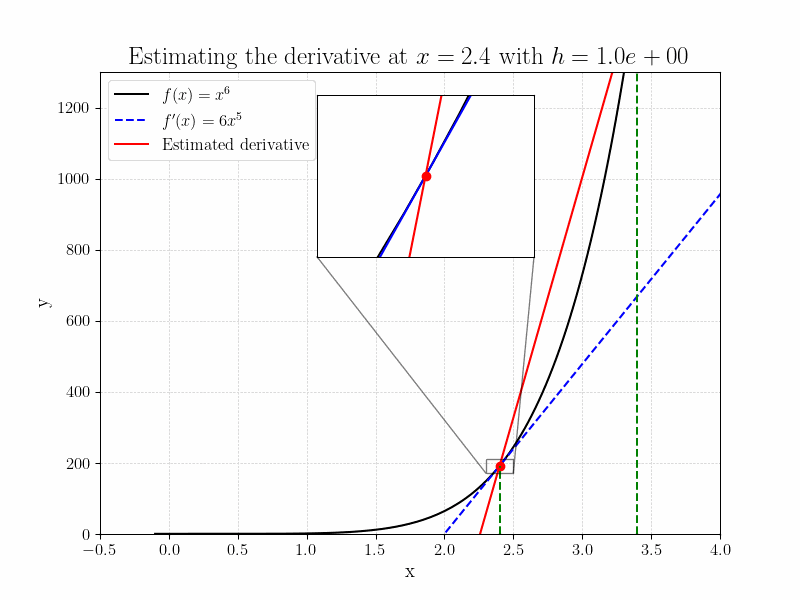

# Calculus

## Derivatives (SP1)

A derivative of a function give the slope of a function at a certain point.
Let's say you have a function showing the distance traveled by a car, intuitively if we 
want to know how fast we are moving at a certain point, we can look at how much distance we have 
traveled in a relatively short time, let's say 1 second. Then our speed at that point is the distance 
we traveled in 1 second. If we make the time interval shorter and shorter, we get a better and better
estimate. There are analytical way of solving this, but for now we will use a numerical method to
estimate these derivatives.

If you are interested [here](https://calculusmadeeasy.org/) is a nice resource on derivatives and other calculus topics



This derivate can be estimated with the following equation (note $f'(x)$ is the
derivative of $f(x)$:

$$ f'(x) \approx \frac{f(x + h) - f(x)}{h} $$

Here we can see the idea of taking a small step $h$ (which could be a short time step) and looking at the 
change in the function value (such as distance), and if we then divide this by the step size, 
we get an estimate of the slope of the function at that point.

Your goal is to implement a function that takes in a function, and a value, and
returns the derivative of the function at that value. use `h=0.0001` as the
default value for h. Note that rounding might be different on your system.

```python
>>> def f(x):
...     return x ** 2

>>> derivative(f, 2)
3.999900000000167

>>> derivative(f, 2, h=1e-7)
4.000000091153311
```

## Polynomials

Polynomials are functions of the form

$$ f(x) = a*n x^n + a*{n-1} x^{n-1} + \ldots + a_1 x + a_0 $$

An example could be

$$ f(x) = 2x^2 + 3x + 1 $$

Your goal is to implement a function that takes in a list of coefficients, and
return a new function that represents the polynomial. Lets take three function
as an example

$$ f(x) = x^2 $$

$$ g(x) = 2x + 1 $$

$$ h(x) = 2x^4 + 3x^3 + x + 1 $$

The function you write should be able to take in the coefficients of these
functions and return a new function that represents the sum of these functions.
Like this:

```python
>>> f = polynomial([0, 0, 1])
>>> g = polynomial([1, 2])
>>> h = polynomial([1, 1, 0, 3, 2])
>>> f(2)
4
>>> g(2)
5
>>> h(2)
57
```

# List usage

## Stride

When indexing a list, we can specify a step size we want, we call this step size
the stride. For example:

```python
>>> x = [1,2,3,4]
>>> x[::2]
[1,3]
```

Your job is to implement a function that can do the exact same as the stride
parameter, without using the parameter. Note that you should therefore also be
able to take in negative values.

```python
>>> x = [1,2,3,4]
>>> stride(x, -2)
[4,2]
```

## Range

You have used the range function frequently during the course, now you are going
to implement it yourself. Your job is to implement a function that takes in a
start, stop and step value, and returns a list of numbers from start to stop,
with the given step size. If the step size is negative, the list should be in
descending order, but only if the start value is larger than the stop value.

```python
>>> range(1, 5, 1)
[1, 2, 3, 4]
>>> range(1, 5, 2)
[1, 3]
```

Now that you have implemented the range function, you have essentially all the
code you need index a list like you would using `x[start:stop:step]`. If you
want do have a more

## Your first DataBase

In this exercise you are going to implement a function that takes in a list of 4
lists, each containg some data, the first element in each list contains the name
of the person, the second element contains their hair color, and the last
contains a list of their favorite numbers.

| users | Name | Hair Color | Favorite numbers |
| ----- | ---- | ---------- | ---------------- |
| **1** | Paul | 'black'    | [0,3,4]          |
| **2** | Anna | 'gray'     | [9,7,1]          |
| **3** | Tom  | 'red'      | [0,3,5]          |
| **4** | Mary | 'blonde'   | [5,4]            |

Write a function that can take this data and an ID, and returns their hair color
and the favorite number (the first element in the list) of the person with that
ID. If the ID is not found, return None.

```python
>>> data = [
...     ['Paul', 'black', [0,3,4]],
...     ['Anna', 'gray', [9,7,1]],
...     ['Tom', 'red', [0,3,5]],
...     ['Mary', 'blonde', [5,4]]
... ]
>>> get_user_data(data, 1)
('black', 0)
>>> get_user_data(data, 2)
('gray', 9)
>>> get_user_data(data, 9)
None
```

## Banking information

In this exercise you are going to implement a function that takes in a list of
client information for a bank. The list contains the name of the client, their
account number, their balance, and a list of transactions. Your job is to
implement a function that takes in this data, and verifies that the balance is
correct. If the balance is not correct, you should return the name of the
client, and the amount discrepancy, else you should return 0.

| Name | Account number | balance | transactions     |
| ---- | -------------- | ------- | ---------------- |
| Paul | 2351           | 208.00  | [210, 2,-4]      |
| Anna | 1935           | -32.30  | [-60, 30, -2.30] |
| Tom  | 2986           | 27.81   | [27, 0.01, 3]    |
| Mary | 4359           | 314.15  | [30, 290, -5.85] |

```python
>>> data = [
...     ['Paul', 2351, 208.00, [210, 2, -4]],
...     ['Anna', 1935, -32.30, [-60, 30, -2.30]],
...     ['Tom', 2986, 27.81,   [27, 0.01, 3]],
...     ['Mary', 4359, 314.15, [30, 290, -5.85]]
... ]
>>> verify_balance(data)
('Tom', 2.2)
```

# Strings

## SpOnGeBoB cAsE

Spongebob case is a way of writing that got popular on the internet, it simply
means that you write a string with alternating capital and lower case letters.
Your job is to implement a function that takes in a string and returns it in
spongebob case. Since this is an informal way of writing, we might as well drop
any punctuation.

```python
>>> spongebob_case('hello')
'hElLo'
>>> spongebob_case('world')
'wOrLd'
>>> spongebob_case('hello, world!')
'hElLo wOrLd'
```

## snake_case

Snake case is a way of writing that is often used in programming, it is a way of
writing where you write all words in lower case, and separate them with an
underscore. Your job is to implement a function that takes in a string and
returns it in snake case. Since this is an informal way of writing, we might as
well drop any punctuation.

```python
>>> snake_case('hello')
'hello'
>>> snake_case('Hello, !World')
'hello_world'
```

## camelCase

Camel case is a way of writing that is often used in programming, it is a way of
writing where you write all words in lower case, except the first letter of each
word after the first word, which is written in upper case. Your job is to
implement a function that takes in a string and returns it in camel case. Since
this is an informal way of writing, we might as well drop any punctuation.

```python
>>> camel_case('hello')
'hello'
>>> camel_case('Hello, !World')
'helloWorld'
```

## Listed

You are trying to enter some data into your program, however for some reason
your data comes in the form of strings, and you need to convert them to a list.
Your job is to implement a function that takes in a string, and returns a list
of the elements in the string. The string will be formatted as follows:

- The string will start with a `[` and end with a `]`
- The elements will be separated by a `,`
- All elements will be floats

```python
>>> listed('[1.0,2.0,3.0]')
[1.0, 2.0, 3.0]
>>> listed('[[1.0,2.0],[,3.0,4.0]]') ## Optional
[[1.0, 2.0], [3.0, 4.0]]
```
